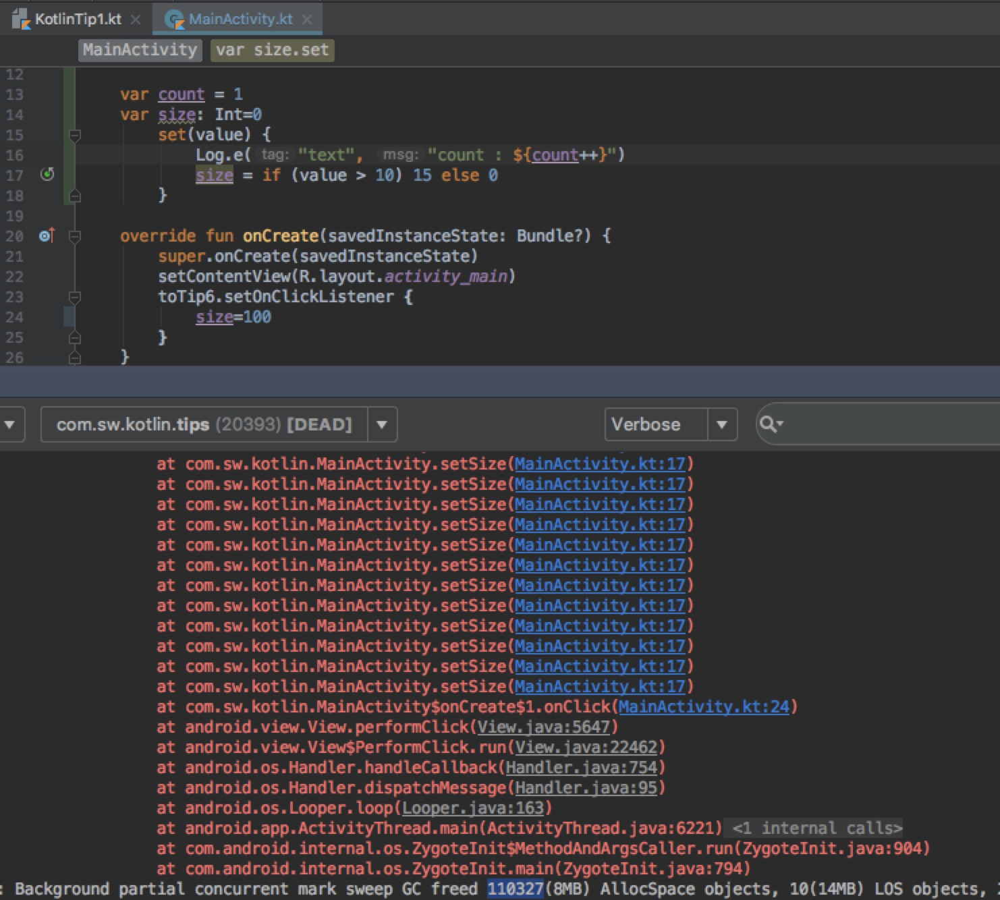
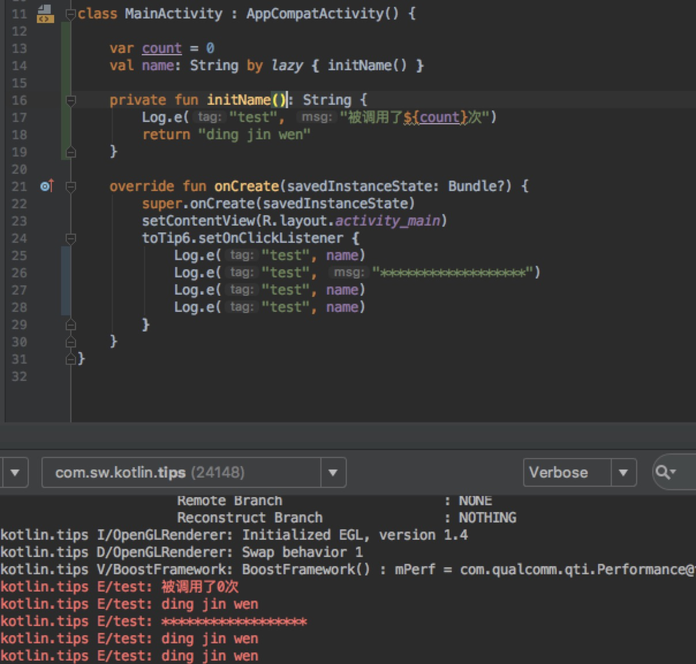

# Kotlin Tips

## Tip1-Kotlin和Java相互查看

### 1. Kotlin转化为Java代码查看
kotlin文件是不能直接转化为Java文件的，但是将Kotlin代码转化成Java语言去理解，步骤如下：在Android Studio中选择Tools ---> Kotlin ---> Show Kotlin Bytecode 这样就把Kotlin转化为class字节码了,class码阅读不太友好，点击左上角的Decompile就转化为Java

### 2. Java文件直接转化为Kotlin文件
再介绍一个小窍门，在前期对Kotlin语法不熟悉的时候，可以先用Java写好代码，再利用AndroidStudio工具将Java代码转化为Kotlin代码，步骤如下：在Android Studio中选中要转换的Java代码 ---> 选择Code ---> Convert Java File to Kotlin File

## Tip2-属性

### 1. 什么时候属性类型不能省略？
``` java
var aa: String = ""//大部分情况下属性类型是可以省略的
属性的修饰符，和方法类似的，属性也有多种修饰符。
public,protected,private,如果可以根据属性的值推断出属性类型，则可省略类型
abstract修饰的属性,自身不能初始化，要在子类进行初始化，不能省略类型
```

### 2. 属性的组成部分
对属性的访问，并不是像Java里面一样，直接访问属性的本身，而是默认调用了 get 和 set 方法，保证了属性的闭合性. 一般属性包含三个部分，set , get 和 backing filed.
``` java
var aa: String = ""
    set(value) {
         field = value //field是（Backing field）幕后字段
    }
    get() {
        return field
    }
```

### 3. 自定义set 和 get 方法
var,val修饰的变量默认是 public 的，编译器会自动生成 set 和 get 方法,也可以手动重写他的 set 和 get 方法,val只有 get 方法
``` java
var aa: String = "ding jin wen "
    set(value) {
        field = value + "  123  "
    }
    get() {
        return field + "大地零一"
    }

    Log.d("text", "aa : $aa")
    aa = "zhang san"
    Log.d("text", "aa : $aa")

    //输出
    aa:ding jin wen 大地零一
    aa:zhang san 123 大地零一
```

### 4. 幕后字段
幕后字段(Backing Fields),kotlin的 get和 set 是不允许访问本身的局部变量的，因为属性的调用也是对get的调用，因此会产生递归，造成栈溢出。


### 5. 延迟初始化lateinit 和 懒初始化by lazy
``` java
lateinit var aa:String

a.lateinit只能用于var声明的类变量，并且属性没有自定义getter或setter方法。

b.属性的类型必须是非空的
```

``` java
val aa:String by lazy { }

a.lazy只能作用在val属性,应用于单例模式
(if-null-then-init-else-return),而且当且仅当属性被第一次调用的时候,委托方法才会执行。

b.lazy()是接受一个 lambda 并返回一个 Lazy <T> 实例的函数,返回的实例可以作为实现延迟属性的委托, 第一次调用 get() 会执行已传递给 lazy() 的 lambda 表达式并记录结果,后续调用 get() 只是返回记录的结果。
```



### 6. 编译器常数值
如果在编译期间，属性值就能被确定，该类属性值使用const 修饰符，类似Java里面的静态常量用法。 这类属性必须满足以下条件：
a. 必须是顶级属性，或者是一个object的成员
b. 值被初始化为 String 类型，或基本类型(primitive type)
c. 只能修饰val常量
d. 不存在自定义的取值方法
``` java
const val key = "key"
object Config {
    const val name="name"//编译时常量
}
```

### 7. 委托属性
> 有一种属性，在使用的时候每次都要手动实现它，但是可以做到只实现一次，并且放到库中，一直使用，这种属性称为委托属性。

委托属性包括：
a. 延迟属性(lazy properties)：上面第5点中已经提到了。
b. 可观察属性(observable properties)：监听得到属性变化通知。
``` java
var mBackPressedTime by Delegates.observable(0L) {
    prop, old, new ->//三个参数，分别是：被赋值的属性，旧值和新值。
        if (new - old > 1000) {
            Toast("再按一次返回就退出")
        }
        if (new - old in 1..1000) {
            finish()
        }
    }
```
c. Map委托属性(Storing Properties in a Map)：将所有属性存在Map中。
``` java
class Person2(private val attributes: Map<String, String>) {
        val name: String by  attributes
        val company: String by  attributes
        val address: String by  attributes
        val email: String by  attributes
    }

    fun main(args: Array<String>) {
        val data = mapOf("name" to "Dmitry", "company" to "JetBrains")
        val p = Person2(data)
        println(p.name) // Dmitry
    }
```

## Tip3-函数

### 1. 变参函数
``` java
//在Java中，我们这么表示一个变长函数
public boolean hasEmpty(String... strArray){
    for (String str : strArray){
        if ("".equals(str) || str == null)
            return true;
    }
    return false;
}

//在Kotlin中，使用关键字vararg来表示
fun hasEmpty(vararg strArray: String?): Boolean{
    for (str in strArray){
        if (str.isNullOrEmpty())
            return true
    }
    return false
}
```

### 2. 扩展函数
* 声明一个扩展函数，我们需要在函数的名称前加上一个接收者类型并且加上.符号,在扩展函数中的this关键字表示接收者对象

``` java
fun Activity.toast(message: CharSequence, duration: Int = Toast.LENGTH_SHORT) {
    Toast.makeText(this, message, duration).show()
}
```

* 扩展是静态解析
``` java
open class Animal

class Dog : Animal()

fun Animal.bark() = "animal"

fun Dog.bark() = "dog"

fun printBark(animal: Animal) {
    println(animal.bark())
}

printFoo(Animal()) 和 printFoo(Dog())打印的都是 animal ,因为在定义扩展函数的时候接收对象类型是Animal类，而且Kotlin的扩展是静态解析的，所以即使调用的时候是传了Animal类的子类Dog类进去，还是会执行定义的时候的类型的函数。
```

### 3. 构造函数
kotlin里面的构造函数，分为主构造函数和次构造函数,主构造函数写在类头中,跟在类名后面,次构造函数写在类体中，关键字是`constructor`,次构造函数必须直接或者间接地委托到主构造函数
``` java
class Student(private var name: String) {
    private var age: Int? = null
    private var classId: Int? = null

    constructor(name: String, age: Int) : this(name) {
        this.age = age
        this.name = name
    }

    constructor(classId: Int, name: String, age: Int) : this(name, age) {
        this.classId = classId
        this.age = age
        this.name = name
    }

    fun sayHello() {
        Log.e("test", "hello $name")
        Log.e("test", "hello $classId")
        Log.e("test", "hello $age")
    }
}
```

### 4. 单例怎么写？
* 不带参数(两种写法)
1. 伴生对象更多的用途是用来创建一个单例类。只是简单的写，直接用伴生对象返回一个val修饰的外部类对象就可以了
``` java
class Single private constructor() {
    companion object {
        val instance = Single()
    }
}
```
2. 伴生对象更多的用途是用来创建一个单例类。如果只是简单的写，直接用伴生对象返回一个 val 修饰的外部类对象就可以了，但是更多的时候我们希望在类被调用的时候才去初始化他的对象。以下代码将线程安全问题交给虚拟机在静态内部类加载时处理，是一种推荐的写法：
``` java
class Single private constructor() {
    companion object {
        val instance: Single by lazy { Holder.INSTANCE }
    }

    private object Holder {
        val INSTANCE = Single()
    }
}
```
* 带参数
``` java
/**
* 简单写法
*/
class Single private constructor(name:String) {
    companion object {
        @Volatile
        private val instance:Single?=null
        fun getInstance(c:String):Single{
            if (instance == null) {
                synchronized(Single::class) {
                    if (instance == null) {
                        instance = Singleton(c)
                    }
                }
            }
            return instance!!
        }
    }
}

/**
 * 带参数的单例，去掉断言，google推荐的写法
 */
class SingleInstance private constructor(name: String) {
    companion object {
        @Volatile
        private var instance: SingleInstance? = null

        fun getInstance(name: String): SingleInstance {
            return instance ?: synchronized(this) {
                instance ?: SingleInstance(name).also {
                    instance = it
                }
            }
        }
    }
}
```

### 5. 静态方法
Kotlin 没有静态方法,在项目中常用的两种方法：
* 用@jvmStatic注解,和Java的static类似
``` java
object StringUtils {
    @JvmStatic fun isEmpty(str: String): Boolean {
        return "" == str
    }
}
```

* 使用伴生对象
``` java
class StringUtils {
    companion object {
    fun isEmpty(str: String): Boolean {
            return "" == str
        }
    }
}
```

### 6. let,apply,with，run,also的用法和区别

先看下面这个例子，打印字母表函数
``` java
/*
*打印字母表函数，在函数内result变量在好几处有使用到
*/
fun alphabet(): String {
    val result = StringBuilder()
    result.append("START\n")
    for (letter in 'A'..'Z') {
        result.append(letter)
    }
    result.append("\nEND")
    return result.toString()
}
```

在上面的函数中，result变量出现了5次，下面分别用apply,with,let来简化这个函数，可以将这5次都不用再出现了

* apply用法：
``` java
/**
* 打印字母表函数，apply函数，调用某对象的apply函数，在函数范围内，可以任意调用该对象的任意方法，并返回该对象
*/
private fun alphabetApply(): String {
    // fun <T> T.apply(f: T.() -> Unit): T { f(); return this }
    return StringBuilder().apply {
        append("START\n")
        for (letter in 'A'..'Z') {
            append(letter)
        }
        append("\nEND")
    }.toString()
}
```

* with用法：
``` java
/**
* 打印字母表函数，with函数是一个单独的函数，并不是Kotlin中的extension，所以调用方式有点不一样，返回是最后一行
*/
private fun alphabetWith(): String {
    // fun <T, R> with(receiver: T, f: T.() -> R): R = receiver.f()
    return with(StringBuilder()) {
        append("START\n")
        for (letter in 'A'..'Z') {
            append(letter)
        }
        append("\nEND")
        toString()
    }
}
```

* let用法：
``` java
/**
 * 打印字母表函数，let函数，默认当前这个对象作为闭包的it参数，返回值是函数里面最后一行，或者指定return
 * XX?.let{}这种写法在代码中，比较常见
 * XX?:let{}
 */
private fun alphabetLet(): String {
    // fun <T, R> T.let(f: (T) -> R): R { f(this)}
    return StringBuilder().let {
        it.append("START\n")
        for (letter in 'A'..'Z') {
            it.append(letter)
        }
        it.append("\nEND")
        it.toString()
        //  return it.toString()
    }
}
```

* also用法：
``` java
/**
* also()函数和let()函数很像，但是返回值为该对象自己
* 字面理解：做。。。的同时也做。。。
*/
fun testAlso() {
    // fun <T> T.also(block: (T) -> Unit): T { block(this); return this }
    "testAlso".apply {
        println("this = " + this)
    }.also { println(it) }
}
```

* run用法：
``` java
/**
* run函数和apply函数很像，只不过run函数是使用最后一行的返回，apply返回当前自己的对象。
*/
fun testRun() {
    // fun <T, R> T.run(f: T.() -> R): R = f()
    "testRun".run {
        println("this = " + this)
    }.let { println(it) }
}
```

### 8.中缀函数
> 中缀表达式是操作符以中缀形式处于操作数的中间（例：3 + 4），先来看一下Kotlin中的中缀函数：
``` java
public infix fun <A,B> A.to(that:B):Pair<A,B> = Pair(this,that)
```

* 在`mapOf()`方法中的`to`就是个中缀函数
``` java
val map: Map<Int,Int> = mapOf(1 to 1,2 to 2)
```

* Range里面的`downTo`也是个中缀函数：
``` java
（10 downTo 1）.forEach{print(it)}
```

使用中缀符号infix可以调用函数，但必须符合一些条件：
* 必须是成员方法或者扩展函数
* 函数只有一个参数
* 使用infix关键字表示

下面来写个中缀函数：
``` java
// 定义扩展函数
infix fun Int.iInfix(x: Int): Int  = this + x

fun main(args: Array<String>) {
    // 用中缀符号表示的扩展函数使用
    println("2 iInfix 1:${2 iInfix 1}") // 打印：2 iInfix 1:3
    // 与下面是相同的
    println("2.iInfix(1):${2.iInfix(1)}") // 打印：2.iInfix(1):3
}
```

## Tip4-自定义委托

### 1. 只读属性实现委托
只读属性（使用val定义）,委托类需实现getValue函数
``` java
interface ReadOnlyProperty<in R, out T> {
    operator fun getValue(thisRef: R, property: KProperty<*>): T
}
```

### 2. 可变属性实现委托
可变属性（使用var定义）,委托类需实现getValue函数和setValue函数
``` java
interface ReadWriteProperty<in R, T> {
    operator fun getValue(thisRef: R, property: KProperty<*>): T
    operator fun setValue(thisRef: R, property: KProperty<*>, value: T)
}
```

### 3. 一个委托实例
下面来看一个自定义的`Delegate`，用来访问`SharedPreference`，这段代码是`Kotlin for Android Developer`的示例：
``` java
class Preference<T>(val context: Context, val name: String, val default: T) : ReadWriteProperty<Any?, T> {

    val prefs by lazy { context.getSharedPreferences("default", Context.MODE_PRIVATE) }

    override fun getValue(thisRef: Any?, property: KProperty<*>): T {
        return findPreference(name, default)
    }

    override fun setValue(thisRef: Any?, property: KProperty<*>, value: T) {
        putPreference(name, value)
    }

    private fun <U> findPreference(name: String, default: U): U = with(prefs) {
        val res: Any = when (default) {
            is Long -> getLong(name, default)
            is String -> getString(name, default)
            is Int -> getInt(name, default)
            is Boolean -> getBoolean(name, default)
            is Float -> getFloat(name, default)
            else -> throw IllegalArgumentException("This type can be saved into Preferences")
        }

        res as U
    }

    private fun <U> putPreference(name: String, value: U) = with(prefs.edit()) {
        when (value) {
            is Long -> putLong(name, value)
            is String -> putString(name, value)
            is Int -> putInt(name, value)
            is Boolean -> putBoolean(name, value)
            is Float -> putFloat(name, value)
            else -> throw IllegalArgumentException("This type can be saved into Preferences")
        }.apply()
    }
}
```

使用的时候：

``` java
class ExampleActivity : AppCompatActivity(){
    var a: Int by Preference(this, "a", 0)

    fun whatever(){
        println(a)//会从SharedPreference取这个数据
        aInt = 9 //会将这个数据写入SharedPreference
        println(a)//会从SharedPreference取这个数据
    }
}
```

## Tip5-委托模式
> Kotlin支持委托模式，与java的动态代理类似，有两个对象参与处理同一个请求，接受请求的对象将请求委托给另一个对象来处理。java里面动态代理是用反射来实现的，还要添加额外的很多代码，相比较kotlin的动态代理就简单很多了。
``` java
interface Animal{
    fun bark()
}

class Dog :Animal {
    override fun bark() {
        Log.e("test","Wang Wang")
    }
}

class Cat(animal: Animal) : Animal by animal {
}

fun main(args: Array<String>) {
   Cat(Dog()).bark()
}

//输出：wangwang
//这个实例中，用狗代理了猫,帮猫处理了叫声的操作
```

``` java
class CountingSet2<T>(val innerSet: MutableCollection<T> = HashSet<T>()) :MutableCollection<T> by innerSet{

    var objectAdded = 0

    init {
        objectAdded += innerSet.size
    }

    override fun add(element: T): Boolean {
        objectAdded++
        return innerSet.add(element)
    }

    override fun addAll(elements: Collection<T>): Boolean {
        objectAdded += elements.size
        return innerSet.addAll(elements)
    }
}

val hashSet = hashSetOf("1", "2", "3", "4")
val set = CountingSet2(hashSet)
set.addAll(listOf("5", "6", "7"))
Log.e("test", "set-----${set.size}----${set.objectAdded}")

//输出：set-----7----7
//这个实例中，用innerSet代理了CountingSet2,帮CountingSet2处理了add,addAll的操作
```

## Tip6-Lambda表达式与高阶函数
### 1. Lambda 表达式的语法
一个Lambda表达式通常使用{ }包围，参数是定义在()内，可以添加类型注解，实体部分跟在“->”后面；如果Lambda的推断返回类型不是Unit，那么Lambda主体中的最后一个（或单个）表达式将被视为返回值。
先来看下面的例子：
``` java
val sum: (Int, Int) -> Int = { x, y -> x + y }

// val printMsg: (String) -> Unit = { msg: String -> println(msg)}
val printMsg = { msg: String ->
	println(msg)
}

fun main(args: Array<String>) {
  sum(2，3)
  printMsg.invoke("hello")
}

//输出：hello
```

### 2. Lambda 表达式的约定
* 当参数只有一个的时候，声明中可以不用显示声明参数，在使用参数时可以用 it 来替代那个唯一的参数。
``` java
class Num {
    fun oneParams(one : (Int) -> Int){
        println("oneParams : ${one(5)}")
    }
}

fun main(args : Array<String>){
    val num = Num()
    // num.oneParams({ it -> it * 2 })
    num.oneParams{it * 2}
}

// 输出oneParams : 10
```

* 当有多个用不到的参数时，可以用下划线来替代参数名(1.1以后的特性)，但是如果已经用下划线来省略参数时，是不能使用 it 来替代当前参数的。

``` java
class Num {
    fun unusedParams(unused : (Int,Int) -> Int){
        println("unusedParams : ${unused(5,10)}")
    }
}

fun main(args : Array<String>){
    val num = Num()
    num.unusedParams { _, used -> used * 2 }
    // num.unusedParams { _, used -> it * 2 }  这种写法是编译不过的，不能使用 it 来替代当前参数的。
}

// 输出 unusedParams : 20
```

* 如果函数的最后一个参数是一个函数，那么我们在用Lambda表达最后一个函数参数的时候，可以把它放在括号()外面，所以下面的写法是等价的。
``` java
class Num {
    fun logic(a: Int, b: Int, calc: (Int, Int) -> Int){
        println("calc : ${calc(a,b)}")
    }
}

fun main(args : Array<String>){
    val num = Num()
    // num.logic(1, 2,{x,y -> x+y})
    num.logic(1, 2){x,y -> x+y}
}
```

* Lambda 最后一条语句的执行结果表示这个 Lambda 的返回值。
``` java
// 写法2
num.unusedParams { _, used ->
    println("print first")
    used * 2
    // 下面这种写法是等价的
    // return@unusedParams used * 2
}
```

* Lambda表达式来简化OnClickListener的写法：
``` java
interface OnClickListener {
    fun onClick()
}

class View {
    var listener: OnClickListener? = null;

    /*
    * 传统方式
    *
    */
    fun setOnClickListener(listener: OnClickListener) {
        this.listener = listener
    }

    fun doSth() {
        // some case:
        listener?.onClick()
    }

    // 但是这种方式仅适用于有一个回调函数的情况

    /*
    * 声明lambda方式，listener: () -> Unit
    * 函数可以是一种类型,一个变量可以是函数类型的
    */
    var listener1:()->Unit


    fun setOnClickListener(listener: () -> Unit) {
        this.listener1=listener
    }

    fun doSth() {
        // some case:
        listener1?.invoke()
    }
}
```

### 3. 高阶函数
* Lambda 表达式最大的特点是可以作为参数传递。当定义一个闭包作为参数的函数，称这个函数为高阶函数。（通常情况下，我们所说的闭包是 Lambda 表达式）
``` java
fun main(args: Array<String>) {
    log("world", printMsg)
}

val printMsg = { str: String ->
    println(str)
}

val log = { str: String, printLog: (String) -> Unit ->
    printLog(str)
}
//输出：world
//log 有两个参数，一个str:String，一个printLog: (String) -> Unit。
```

* 函数作为返回值
函数作为返回值也非常实用，例如我们的需求是根据不同的快递类型返回不同计价公式，普通快递和高级快递的计价规则不一样，这时候我们可以将计价规则函数作为返回值：
``` java
enum class Delivery {
    STANDARD, EXPEDITED
}

/*
* 根据不同的运输类型返回不同的快递方式
* */
fun getShippingCostCalculator(delivery: Delivery): (Int) -> Double {
    if (delivery == Delivery.EXPEDITED) {
        return { 6 + 2.1 * it }
    }
    return { 1.3 * it }
}

fun test05() {
    val calculator1 = getShippingCostCalculator(Delivery.EXPEDITED)
    val calculator2 = getShippingCostCalculator(Delivery.STANDARD)
    println("Ex costs ${calculator1(5)}")
    println("St costs ${calculator2(5)}")
}
```
如果是普通快递，采用1.3 * it的规则计算价格，如果是高级快递按照6 + 2.1 * it计算价格，根据不同的类型返回不同的计价函数。

## Tip7-数据类

### 1. 用法和重要方法介绍
* `data class User(var name: String, var age: Int)`
会自动生成`getter`和`setter`方法，还有`componentN()`，对应按声明顺序出现的所有属性，如`name`就是`component1()`，`age`就是`component2()`。
当然还有 `equals()`、`hashCode()`、和 `toString()`（输出的格式为User(name=..., age=...)）

* 如果构造函数参数中没有声明是val或者var，这些函数就不会生成

* 主构造函数需要有至少一个参数

* 数据类不能有abstract、open、sealed和inner修饰

* 在1.1版本之前，数据类只能实现接口

* 在构造函数那里也说过，如果生成的类需要一个无参数的构造函数，则必须指定所有属性的默认值
`data class User(var name: String = "lily", var age: Int = 0)`
eg.比如适用fastjson解析json串为对象时，要求数据类必须有一个无参的构造函数，就要用到上面的写法了

* 复制`(copy)`
数据类在创建的时候，除了会生成上面的几个方法外，还会生成一个`copy()`函数，`copy()`能够复制一个对象改变它的一些属性情况下，又要保持其余的不变，如上面的`User`类，`copy()`函数的实现：
``` java
fun copy(name: String = this.name, age: Int = this.age) = User(name, age)
```
* 在使用copy()之后，就可以修改数据类的一些属性了：
``` java
val jack = User(name = "jack", age = 1)
val olderJack = jack.copy(age = 2)
```
### 2.Pair和Triple
Kotlin提供了`Pair`和`Triple`作为标准数据类，命名数据类是更好的设计选择。
两个参数的时候使用Pair数据类
三个参数的时候使用Triple数据类
``` java
/**
* 元组（Tuple），给多个变量同时赋值，分二元（Pair）和三元（Triple）
 */
val (year, month, day) = Triple(2017, "6月", "14号")
Log.e("test", "${year}年$month$day")

val date = Triple(2017, "6月", "14号")
Log.e("test", "${date.first}年${date.second}${date.third}")
//二元同上，把Triple换成Pair
 ```

### 3.解构声明
在Kotlin中创建变量的话是这样的
``` java
data class Person(var name: String, var age: Int)

fun main(args: Array<String>) {
    val person = Person("jowan", 1)
    var name = person.name
    var age = person.age
    println(name) // 打印jowan
    println(age) // 打印1
}
```

* 使用解构变量，同时创建多个变量
``` java
data class Person(var name: String, var age: Int)

fun main(args: Array<String>) {
    val (name, age) = Person("person", 1)
    println(name) // 打印person
    println(age) // 打印1
}
```

## Anko
> Anko是 JetBrains 公司开发的一个强大的库，主要的目的是用来替换之前用XML的方式，来使用代码生成UI布局

### 1. Anko四个组成部分内容

1. Anko Commons
轻量级的一些帮助类，比如 intent，dialog，logging 等等，其实就是对安卓一些类：Activity、Fragment、Intent 等添加扩展函数。
2. Anko Layouts
动态布局用的最主要的库，将许多 Android 的控件 View 转换成了 Anko 加载的形式。
由于 Android 还有其他的控件库，因此 Anko 也对那些库进行了拓展支持，可以选择添加对应的依赖库。
当然，还可以根据需要对自定义 View 进行改造，让它们也支持 Anko 加载的形式。
3. Anko SQLite
用于 Android SQLite 数据库的查询的库
4. Anko Coroutines
基于 kotlinx.coroutines 协程的一个工具库。

### 2. Anko用法示例

* Anko Toast的简单用法
``` java
toast("大地零一")
longToast("大地零一")
```

* Anko Dialog的简单用法
``` java
alert("确定删除吗?"){
yesButton { toast("确定") }
noButton { toast("取消") }
}.show()
```

* Anko Intent的简单用法
``` java
startActivity(intentFor<MainActivity().singleTop())
```

* Anko Coroutines
Anko还提供了协程的用来做一些耗时的操作，提供的操作为bg{},具体代码如下：
``` java
async(UI){//UI线程
    val data: Deferred<MyBean> = bg {//后台线程
        // Runs in background
        MyBean()
    }

    showData(data.await()) //await方法将一直等待bg返回的数据
}
```

为了防止内存泄漏我们常会使用弱引用，在Anko中使用弱引用方法如下
``` java
val ref: Ref<AnkoActivity05> = this.asReference()
    async(UI){
        //ref替代了this@AnkoActivity05
        ref().showData()
    }
```

* Anko Layout
``` xml
<LinearLayout
    xmlns:android="http://schemas.android.com/apk/res/android"
    android:layout_height="match_parent"
    android:padding="30dp"
    android:layout_width="match_parent">

    <EditText
        android:id="@+id/todo_title"
        android:layout_width="match_parent"
        android:layout_heigh="wrap_content"
        android:hint="@string/title_hint" />

    <!-- Cannot directly add an inline click listener as onClick delegates implementation to the activity -->
    <Button
        android:layout_width="match_parent"
        android:layout_height="wrap_content"
        android:text="@string/add_todo" />

</LinearLayout>

```
用 Anko 描述的同样的视图
``` java
verticalLayout {
    padding = dip(30)
    var title = editText {
        id = R.id.todo_title
        hintResource = R.string.title_hint
    }
    button {
        textResource = R.string.add_todo
        onClick { view -> {
                // do something here
                title.text = "Foo"
            }
        }
    }
}
```

### 3. 不足

* Anko 好是好，但是依旧不够完美。

* 在 XML 中能够设置的控件属性更多，更精确的控制布局状态，而 Anko 在构建简单界面的时候才显得快速、便捷。

* 而且 Anko 支持的控件有限，加载自定义的控件还得添加额外的代码，在更复杂的应用中应该不太会广泛的使用。

### 总结
* Kotlin是一门相对比较新的JVM语言，JetBrains自2011年以来一直在积极地开发。多年来，该语言在Android社区受到的关注度越来越高，并在Google IO 2017大会之后成为Android开发领域最热门的话题。这次大会宣布，Android正式支持Kotlin。Kotlin在Java以及多种语言的基础上，去掉了冗余代码，代码更加简洁，可读性更强，Kotlin还为已有的Java类提供一组好用的扩展,绝大部分Java能实现的功能kotlin也是可以实现的，以后开发中，推荐大家能使用Kotlin的地方尽量使用。